<div align="center">

# Splitly

**Split what people actually ordered, not the whole bill equally.**

A full-stack expense splitter with item-level splitting, proportional tax, a confirm-to-clear settlement flow, budgets and spending insights.


<!-- Add your live demo link here, for example: **[Live demo](https://your-app.vercel.app)** -->

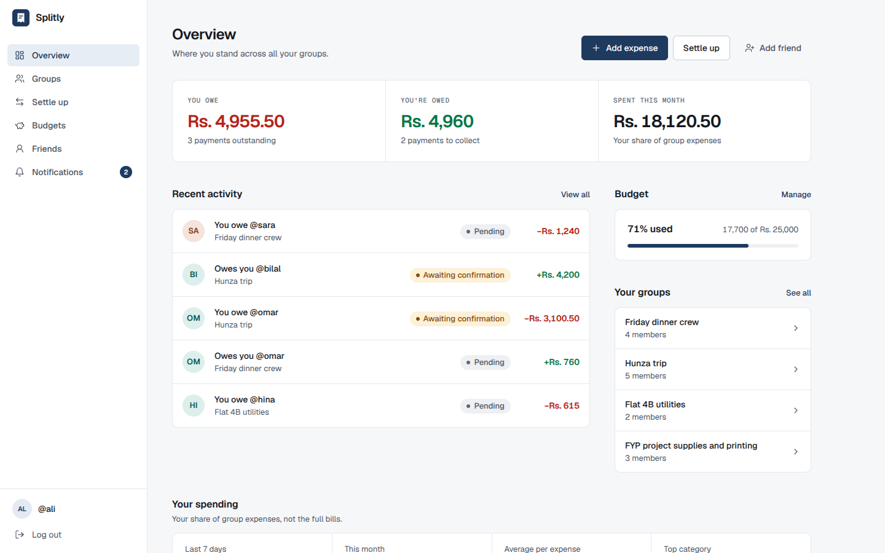

</div>

---

## Table of contents

- [Why Splitly](#why-splitly)
- [Features](#features)
- [Screenshots](#screenshots)
- [Tech stack](#tech-stack)
- [How it works](#how-it-works)
- [Getting started](#getting-started)
- [Using the app](#using-the-app)
- [Reading the interface](#reading-the-interface)
- [API reference](#api-reference)
- [Data model](#data-model)
- [Project structure](#project-structure)
- [Design and accessibility](#design-and-accessibility)
- [Deployment](#deployment)
- [Troubleshooting](#troubleshooting)
- [Known limitations and roadmap](#known-limitations-and-roadmap)

---

## Why Splitly

Most bill-splitting apps divide the total equally, so the person who ordered a salad ends up paying for someone else's steak. Splitly lets you assign every item to the people who actually had it, then shares the tax in proportion to what each person ordered.

**Example.** A steak (Rs. 200) shared by Ali and Sara, and a salad (Rs. 80) for Sara, with 7% tax:

| Person | Items | Tax share | Owes |
| --- | ---: | ---: | ---: |
| Ali | 100.00 | 7.00 | **Rs. 107.00** |
| Sara | 180.00 | 12.60 | **Rs. 192.60** |
| **Total** | 280.00 | 19.60 | **Rs. 299.60** |

---

## Features

### Accounts and friends
- Register and log in with email and password. Sessions use JWT and last 7 days.
- Live form validation, a show/hide password toggle, a Caps Lock warning and a password strength meter.
- Search people by username and add them as friends straight away, with no approval step.

### Groups and invites
- Create groups with a category and pick members from your friends.
- Invite anyone with a **shareable link or QR code**. Invite links survive the login step, so new users land in the group right after signing up.
- Each group shows every member's net balance at a glance.

### Item-level expense splitting
- Add items one by one and choose exactly who shared each one, or tap **Everyone**.
- Set the tax percentage. It is split in proportion to each person's subtotal.
- Choose who paid, and see a live receipt-style summary before you confirm.
- Guardrails: an item can't be saved without at least one person assigned.
- **AI receipt scan (optional).** Upload a photo of a receipt and the items, prices and tax are extracted and pre-filled for you to review. Manual entry always works without it.

### Settlements
- A clear three-step flow: the person who owes **marks it as paid**, the person owed **confirms it**, and the payment is **cleared**.
- Only the right person can take each step. The server rejects anyone else.
- **Simplify debts** shows the smallest set of transfers that settles a whole group.
- A summary rail shows your net position, what needs your action, and your net balance with each person.

### Dashboard and insights
- Overview of what you owe, what you're owed and what you spent this month.
- Recent activity with a status on every payment.
- Spending insights: last 7 days, this month, average per expense, top category, a weekly bar chart and a category breakdown.
- All figures count **your share** of group expenses, not the full bills.

### Budgets
- Set a monthly limit for each category (Food, Travel, Home, Entertainment, Education, Project, Shopping, Health, Other).
- Progress bars change colour as you approach and pass your limit.
- See a daily allowance for the rest of the month and which categories have spending but no budget yet.

### Notifications
- In-app notifications are created automatically when an expense includes you, when someone marks a payment as paid, and when a payment is cleared.
- An unread badge in the navigation and clear read/unread states.

### Interface
- Fully responsive: sidebar navigation on desktop, a bottom tab bar on phones.
- Loading, empty and error states on every screen, with retry.
- Built with accessibility in mind (see [Design and accessibility](#design-and-accessibility)).

---

## Screenshots

| | |
| --- | --- |
| **Sign in** <br> 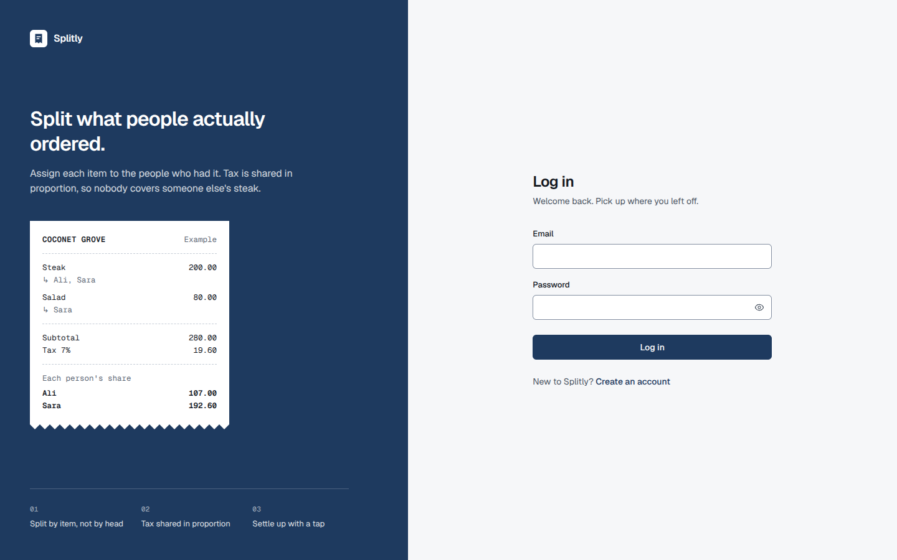 | **Group with balances** <br> 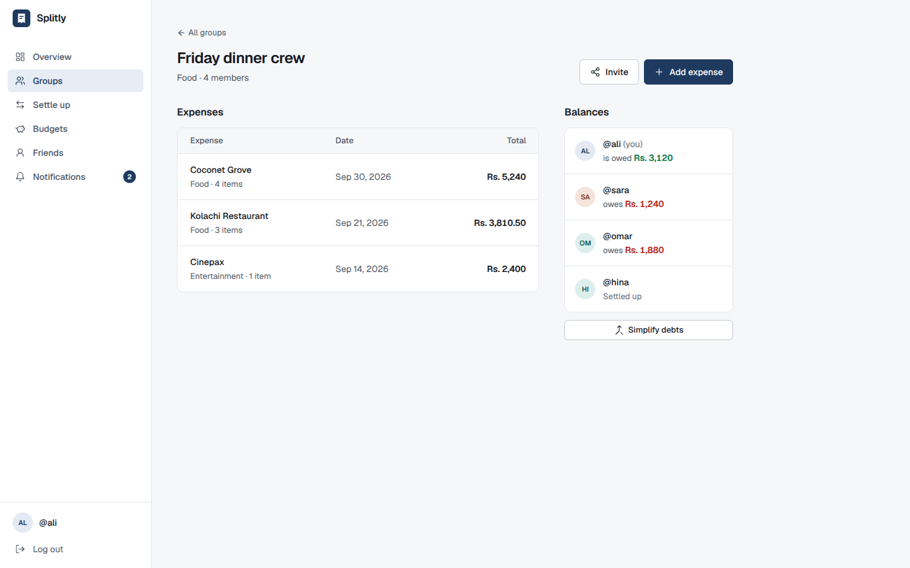 |
| **Item-level expense** <br> 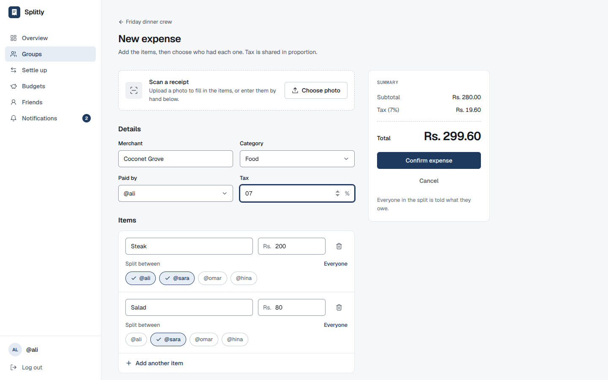 | **Settle up** <br> 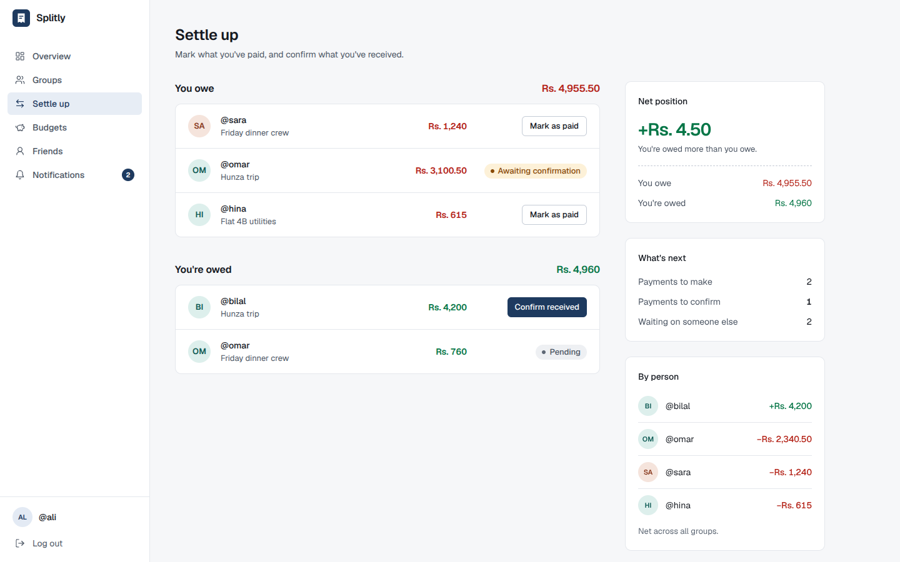 |
| **Budgets** <br> 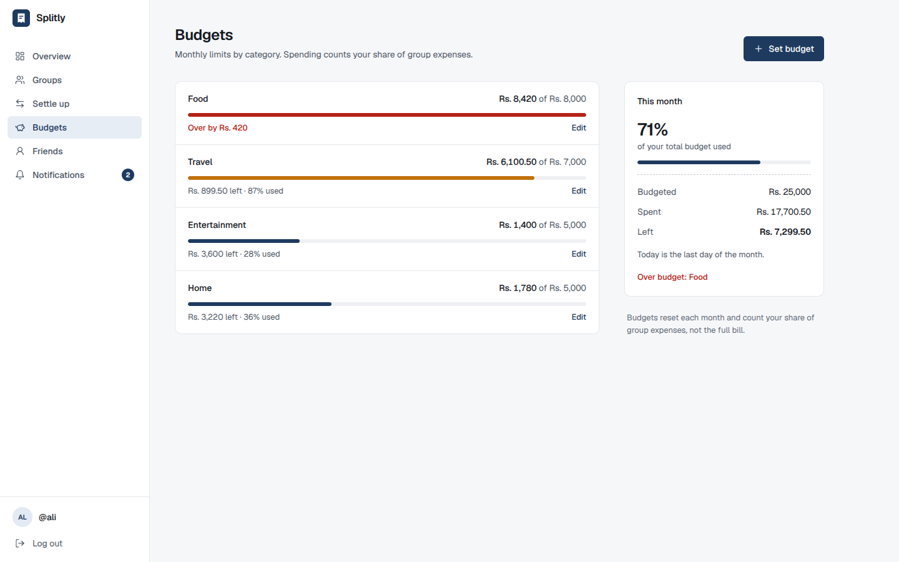 | |

**On mobile**

<p>
  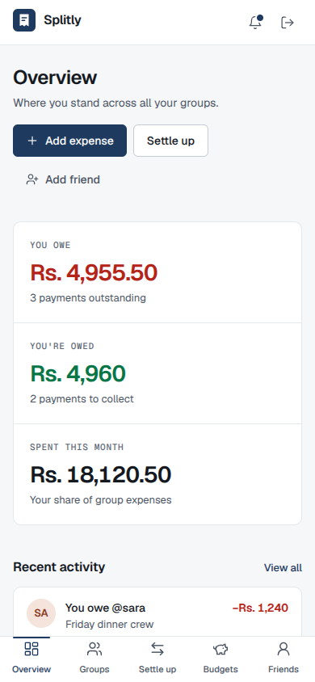
  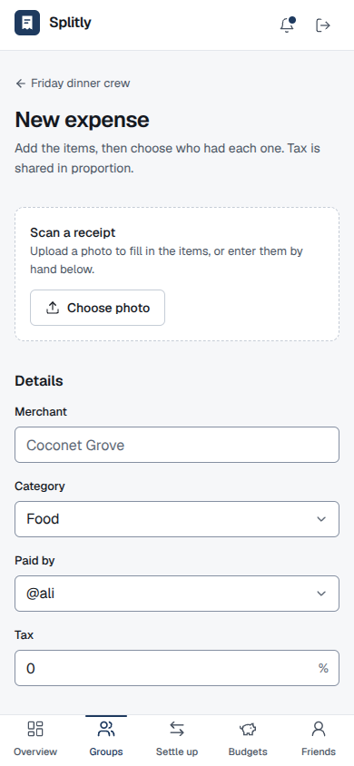
  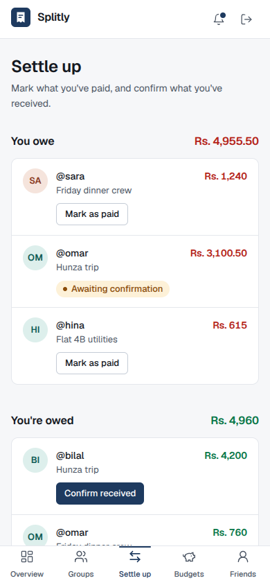
</p>

---

## Tech stack

| Layer | Technology |
| --- | --- |
| **Frontend** | React 18, Vite 5, React Router 6, Tailwind CSS 3, Recharts, Axios, Lucide icons, `qrcode.react` |
| **Typography** | Geist and Geist Mono, self-hosted with Fontsource |
| **Backend** | Node.js, Express 4, Mongoose 8 |
| **Database** | MongoDB (Atlas or local) |
| **Auth** | JSON Web Tokens, bcrypt password hashing |
| **File upload** | Multer (in-memory, 8 MB limit) for receipt scans |
| **AI (optional)** | Google Gemini for receipt scanning |
| **Suggested hosting** | Vercel (client), Render (server), MongoDB Atlas (database) |

---

## How it works

### Splitting an expense
1. Every item is divided equally among the people assigned to it.
2. Each person's item subtotal, divided by the bill subtotal, gives their proportion.
3. The tax amount is multiplied by that proportion to get their tax share.
4. Everyone except the payer gets a settlement record: *"you owe the payer this amount."*

This lives in [`server/utils/splitEngine.js`](server/utils/splitEngine.js) and [`server/utils/settlementEngine.js`](server/utils/settlementEngine.js).

### Settlement lifecycle

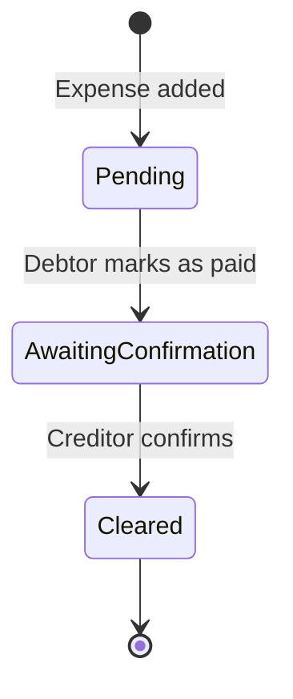

| Status | Shown as | Who can act next |
| --- | --- | --- |
| `pending` | Pending | The person who owes marks it as paid |
| `marked_paid` | Awaiting confirmation | The person owed confirms receipt |
| `cleared` | Cleared | Nobody. It leaves everyone's outstanding list |

### Simplify debts
Raw settlements can form chains (A owes B, B owes C). Splitly works out each person's net balance, then greedily matches the largest debtor with the largest creditor until everything is zero.

> **Example:** Ali owes Sara Rs. 500 and Sara owes Omar Rs. 500. Simplified, Ali pays Omar Rs. 500 directly, so two transfers become one.

The simplified result is a **preview**. It doesn't change any stored payments.

---

## Getting started

### Prerequisites
- **Node.js 18 or newer** (developed on Node 20)
- A **MongoDB** database: a free [MongoDB Atlas](https://www.mongodb.com/atlas) cluster, or MongoDB running locally
- *(Optional)* a [Gemini API key](https://aistudio.google.com/apikey) for receipt scanning

### 1. Clone the repository
```bash
git clone https://github.com/<your-username>/<your-repo>.git
cd <your-repo>
```

### 2. Set up the server
```bash
cd server
npm install
```

Create `server/.env`. Copy `.env.example` and fill in the values:

```bash
# macOS / Linux
cp .env.example .env
# Windows (Command Prompt)
copy .env.example .env
```

| Variable | Required | Description |
| --- | :---: | --- |
| `MONGO_URI` | Yes | MongoDB connection string |
| `MONGO_DB_NAME` | Yes | Database name, for example `splitly` |
| `JWT_SECRET` | Yes | Long random string used to sign login tokens |
| `PORT` | No | Server port. Defaults to `5000` |
| `GEMINI_API_KEY` | No | Enables receipt scanning. Without it, manual entry still works |
| `GEMINI_MODEL` | No | Gemini model used for scanning |
| `CLIENT_URL` | No | Production only: your website address, if you restrict CORS |

Start the server:
```bash
npm run dev      # auto-restarts on changes
# or
npm start
```
You should see `Server running on port 5000` and `MongoDB Connected`.

### 3. Set up the client
In a second terminal:
```bash
cd client
npm install
npm run dev
```
Open **http://localhost:5173**.

| Variable (in `client/.env`) | Description |
| --- | --- |
| `VITE_API_URL` | Address of the API. Defaults to `http://localhost:5000`. Don't include a trailing slash or `/api` |

### 4. Add demo data (optional)
The [`server/seed`](server/seed) folder contains ready-made demo data: six accounts, groups, expenses, payments in every state, budgets and notifications. It is written as MongoDB Extended JSON, so you can import each file into its collection with **MongoDB Compass** (Add data → Import JSON). See [`server/seed/README.md`](server/seed/README.md) for the exact steps.

| Login | Password |
| --- | --- |
| `ali@demo.com` (main demo account) | `Demo@1234` |
| `sara@demo.com`, `omar@demo.com`, `hina@demo.com`, `bilal@demo.com`, `zainab@demo.com` | `Demo@1234` |

Dates in the demo data are relative to when it was generated. To refresh them:
```bash
cd server
node seed/generate-demo-data.mjs
```

### Scripts

| Location | Command | Purpose |
| --- | --- | --- |
| `client` | `npm run dev` | Start the development server |
| `client` | `npm run build` | Production build into `dist/` |
| `client` | `npm run preview` | Preview the production build |
| `server` | `npm run dev` | Start with auto-restart (nodemon) |
| `server` | `npm start` | Start for production |

---

## Using the app

1. **Create two accounts.** Use a second browser or a private window so you can play both sides.
2. **Add a friend.** Go to **Friends**, search for a username and add them.
3. **Create a group.** Go to **Groups → New group**, choose a category and pick your friends. You can also share the invite link or QR code from the group page.
4. **Add an expense.** Open the group and choose **Add expense**. Enter the merchant, tax and payer, then add each item and tap who shared it. Try the [steak and salad example](#why-splitly).
5. **Check balances.** The group page shows who owes and who is owed. Use **Simplify debts** to preview the fewest transfers.
6. **Settle up.** As the person who owes, open **Settle up** and choose **Mark as paid**. As the person owed, choose **Confirm received**. The payment is now cleared.
7. **Set a budget.** Go to **Budgets → Set budget**, pick a category and a monthly limit, then add expenses in that category to watch the bar fill.
8. **Check notifications.** Adding an expense, marking a payment as paid and confirming it each notify the other person.

---

## Reading the interface

**Amounts**

| Indicator | Meaning |
| --- | --- |
| Red amount with a minus sign | You owe this |
| Green amount with a plus sign | You're owed this |

**Payment status badges**

| Badge | Meaning |
| --- | --- |
| Grey **Pending** | Nothing has happened yet |
| Amber **Awaiting confirmation** | The payer says they've paid, and the other person hasn't confirmed |
| Green **Cleared** | Confirmed and finished |

**Budget bars**

| Colour | Meaning |
| --- | --- |
| Navy | Comfortably within the limit |
| Amber | 85% or more of the limit used |
| Red | Over the limit |

**Notifications**

| Type | Sent when |
| --- | --- |
| New expense | Someone adds an expense that includes you |
| Payment marked as paid | Someone says they've paid you, and you need to confirm |
| Payment cleared | Someone confirmed your payment |
| Reminder, Group invite | Supported by the data model and shown in the interface, but not yet triggered automatically by the server |

A dot and bold text mark unread notifications, and the navigation shows the unread count.

---

## API reference

All routes are under `/api`. Every route except `auth/*`, `health` and the invite preview requires the header `Authorization: Bearer <token>`.

| Method | Endpoint | Description |
| --- | --- | --- |
| `GET` | `/health` | Server health check |
| `POST` | `/auth/register` | Create an account |
| `POST` | `/auth/login` | Log in and receive a token |
| `GET` | `/users/me` | Current user with friends |
| `GET` | `/users/search?q=` | Search users by username |
| `GET` | `/users/friends` | List friends |
| `POST` | `/users/friends/:userId` | Add a friend |
| `POST` | `/groups` | Create a group |
| `GET` | `/groups` | Groups you belong to |
| `GET` | `/groups/:id` | Group detail with expenses, settlements and balances |
| `POST` | `/groups/:id/members` | Add a member |
| `GET` | `/groups/join/:inviteCode` | Preview a group from an invite code |
| `POST` | `/groups/join/:inviteCode` | Join a group |
| `POST` | `/expenses` | Create an expense and its settlements |
| `GET` | `/expenses/group/:groupId` | Expenses in a group |
| `GET` | `/settlements/mine` | What you owe and are owed |
| `PATCH` | `/settlements/:id/mark-paid` | Debtor marks a payment as paid |
| `PATCH` | `/settlements/:id/confirm` | Creditor confirms and clears it |
| `GET` | `/settlements/group/:groupId/simplify` | Preview simplified transfers |
| `GET` | `/budgets` | Budgets with this month's spending |
| `POST` | `/budgets` | Create or update a category budget |
| `GET` | `/analytics/overview` | Dashboard summary figures |
| `GET` | `/analytics/category-breakdown` | This month's spending by category |
| `GET` | `/analytics/weekly` | Spending for each of the last 7 days |
| `GET` | `/notifications` | Your notifications |
| `PATCH` | `/notifications/:id/read` | Mark a notification as read |
| `POST` | `/notifications/remind/:settlementId` | Reminder placeholder (currently returns a confirmation only) |
| `POST` | `/ai/scan-receipt` | Extract items from a receipt image (`multipart/form-data`, field `receipt`) |

**Create expense** request body:
```json
{
  "groupId": "…",
  "merchant": "Coconet Grove",
  "category": "Food",
  "taxPercent": 7,
  "paidBy": "<userId>",
  "items": [
    { "name": "Steak", "price": 200, "participants": ["<aliId>", "<saraId>"] },
    { "name": "Salad", "price": 80, "participants": ["<saraId>"] }
  ]
}
```

---

## Data model

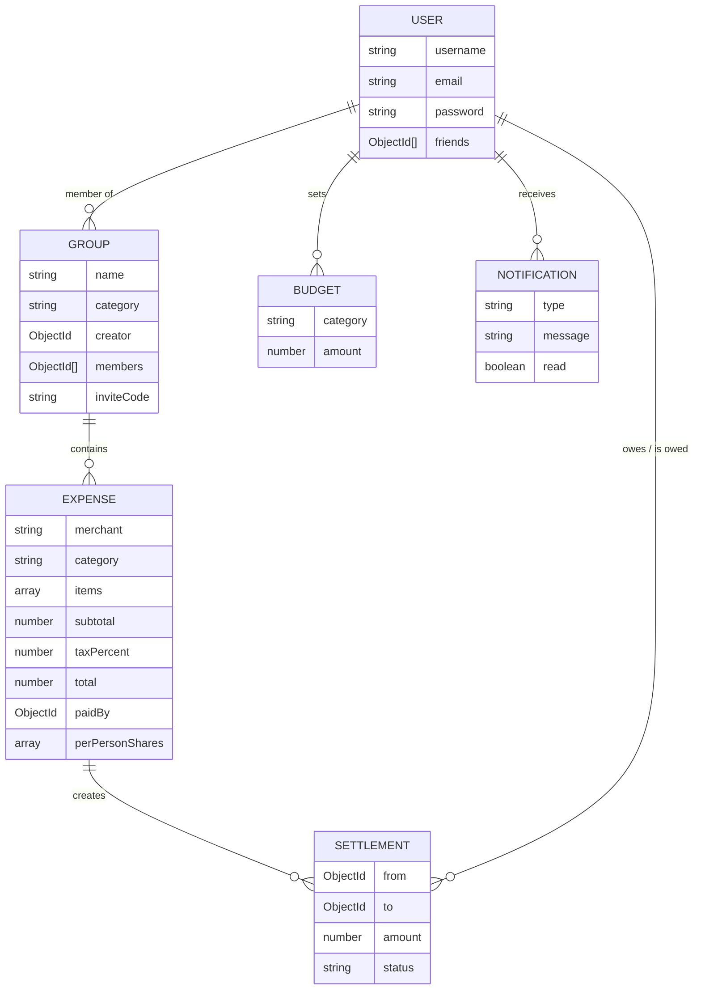

---

## Project structure

```
.
├── client/                     React + Vite + Tailwind
│   ├── public/                 Favicon and SPA redirect rules
│   ├── src/
│   │   ├── api/                Axios instance (attaches the JWT)
│   │   ├── components/
│   │   │   ├── ui/             Design-system components (Button, Field, Badge, Avatar, Amount…)
│   │   │   └── …               Layout, AuthLayout, ProtectedRoute, StatusBadge, ProgressBar…
│   │   ├── context/            AuthContext
│   │   ├── hooks/              useResource (loading / error / reload)
│   │   ├── pages/              Login, Register, Dashboard, Groups, GroupDetail,
│   │   │                       CreateExpense, Friends, Settlements, Budgets,
│   │   │                       Notifications, JoinGroup
│   │   ├── utils/              Formatting, validation, balances, categories
│   │   ├── App.jsx             Routes
│   │   └── index.css           Design tokens
│   ├── tailwind.config.js
│   └── vercel.json             Single-page-app rewrite for Vercel
├── server/                     Express + Mongoose
│   ├── config/db.js            Database connection
│   ├── middleware/             JWT authentication
│   ├── models/                 User, Group, Expense, Settlement, Budget, Notification
│   ├── routes/                 auth, users, groups, expenses, settlements,
│   │                           budgets, analytics, notifications, ai
│   ├── utils/                  splitEngine, settlementEngine
│   ├── seed/                   Demo data generator and importable JSON files
│   └── server.js
├── docs/screenshots/           Images used in this README
└── README.md
```

---

## Design and accessibility

The interface follows a restrained "ledger" look: cool neutral surfaces, hairline dividers, one brand colour, and red and green reserved for money owed and money received. Numbers use tabular figures so columns line up, and a receipt-style motif runs through the summary panels.

- **Design tokens.** Colours, type scale, radius and shadows are defined once in CSS variables and Tailwind config.
- **Contrast.** Text colour pairs meet WCAG AA, and form field borders meet 3:1.
- **Keyboard and screen readers.** Skip link, visible focus states, labelled form fields, meaningful button labels, `aria-live` for status changes and errors, and tables built with real table markup.
- **Colour is never the only signal.** Amounts carry a sign, badges carry text, and the password meter states its result in words.
- **Responsive.** Layouts adapt from 320 px phones to wide desktops, and the summary panel drops below the content on narrower screens.

---

## Deployment

The suggested setup is **MongoDB Atlas + Render (API) + Vercel (website)**.

1. **Database.** In Atlas, under *Network Access*, allow connections from your host. Render uses changing addresses, so `0.0.0.0/0` is the usual setting.
2. **Server on Render.** Create a Web Service with *Root Directory* `server`, *Build Command* `npm install` and *Start Command* `npm start`. Add the environment variables from the [server table](#2-set-up-the-server), and set `NODE_VERSION` to `20`. Use a new, strong `JWT_SECRET` in production. Confirm `https://<your-service>.onrender.com/api/health` responds.
3. **Client on Vercel.** Import the repository with *Root Directory* `client` and the Vite preset. Set `VITE_API_URL` to your Render address, without a trailing slash and without `/api`. Vite reads this at build time, so redeploy after changing it. `client/vercel.json` and `client/public/_redirects` make page refreshes work with client-side routing.
4. **Restrict CORS (recommended).** In `server/server.js`, use `app.use(cors({ origin: process.env.CLIENT_URL || true }))` and set `CLIENT_URL` to your Vercel address.

> **Note:** Render's free instances go to sleep after about 15 minutes without traffic, so the first request afterwards can take 30 to 60 seconds. Open the health URL shortly before a demo to warm it up.

Never commit your `.env` file. It is already listed in `.gitignore`.

---

## Troubleshooting

| Problem | Likely cause and fix |
| --- | --- |
| `querySrv ECONNREFUSED` or `ENOTFOUND` when connecting to Atlas | Your network or DNS can't resolve the `mongodb+srv://` address. Switch your system DNS to `8.8.8.8` and `1.1.1.1`, try another network, or use the standard `mongodb://` connection string from Atlas |
| Server exits right after starting | Check `MONGO_URI`, `MONGO_DB_NAME` and `JWT_SECRET` in `server/.env` |
| "Network Error" in the browser | The server isn't running, or `VITE_API_URL` is wrong, or CORS is blocking your website address |
| The website loads but shows no data on Atlas | Your IP isn't allowed in Atlas *Network Access* |
| A page gives a 404 after refresh in production | The single-page-app rewrite is missing. Keep `client/vercel.json` (Vercel) or `client/public/_redirects` (Netlify) |
| Receipt scan says it isn't configured | Add `GEMINI_API_KEY` to `server/.env` and restart the server |
| Login says "That email and password don't match" | Check the email and password, or register a new account |

---

## Known limitations and roadmap

**Current limitations**
- No password reset or email verification.
- Notifications are in-app only, and reminders and group-invite notifications aren't triggered yet. Email and push delivery aren't wired up.
- Receipt scanning handles a single clear image. Blurry or multi-page receipts fall back to manual entry.
- CORS is open by default and should be restricted in production.
- The client ships as a single JavaScript bundle without code-splitting.
- There is no automated test suite yet.

**Ideas for next steps**
- Password reset and email verification
- Payment reminders, group-invite notifications, and email or push delivery
- Rate limiting and request validation on the API
- Editing and deleting expenses
- Multiple currencies
- Automated unit and end-to-end tests